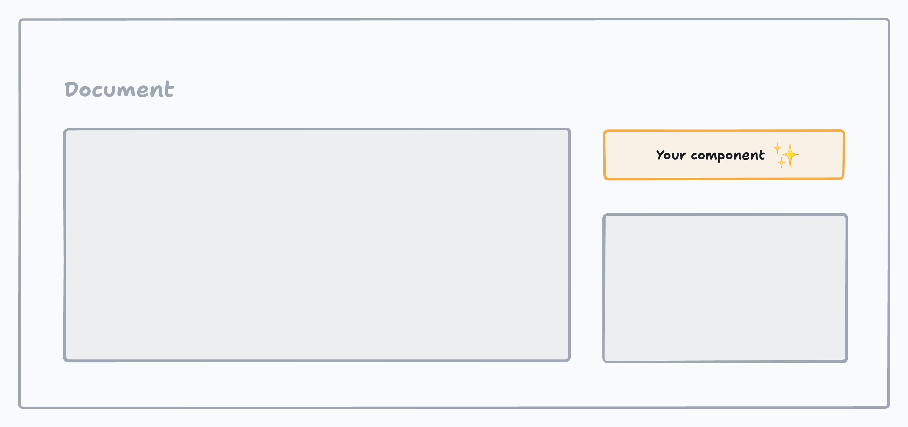

# crx-base

Build browser extensions in a modern way. No more vanilla JS, no more Webpack.



- React, TypeScript
- [Rollup](https://github.com/rollup/rollup) with [some plugins](/rollup.config.js)
- [shadcn/ui](https://ui.shadcn.com/) components, including TailwindCSS

## Purpose

The purpose of this code base is to serve as a template for building browser extensions with React. It is not a boilerplate, but rather a starting point for your own project. The main goal is to provide a modern development environment without the need to configure Webpack or Babel. It uses Rollup to bundle the code and shadcn/ui for the UI components.

This codebase offers the key feature of using TailwindCSS and shadcn/ui components. It allows you to inject your content script into any document without having to worry about styling conflicts, thanks to [postcss-scope](https://github.com/jackall3n/postcss-scope).

## Getting started

Browser extensions may require different setups depending on the functionality it is intended to implement. The following steps will guide you through the setup process for building your extension in the desired way.

### Injecting components into a webpage

`crx-base` provides `onElementLoaded` and `onElementLoadedAsync` functions to inject components into a webpage when a specific element is loaded.

```typescript
import { onElementLoaded } from '@/lib/crx-base';
import RootContext from '@/lib/crx-base/context'

onElementLoaded('#waiting_element_selector', (element) => {
    const container = document.createElement('div');
    container.classList.add('root_extension');

    element.appendChild(container);

    createRoot(container).render(
        <RootContext value={{ container }}>
            <App />
        </RootContext>
    );
})
```

### Using background scripts

_TODO_.

### Using popup scripts

_TODO_.